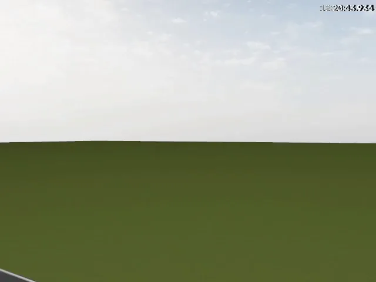
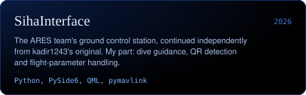
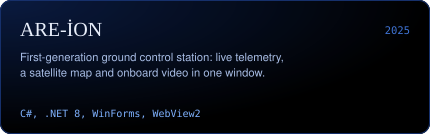
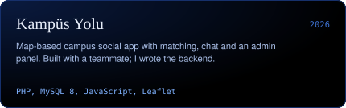
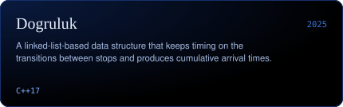

I'm Hüseyin Emir Akay, a third-year Computer Engineering student at Atatürk University. I build ground control station and operator interface software for unmanned aerial vehicles, and I'm vice captain and software developer of the ARES UAV team, a TEKNOFEST Fighting UAV finalist in 2025 (25th of 873 teams) and 2026 (34th of 1053).

## What I work on

- **Ground control stations.** Two generations of the ARES ground control station: I built the 2025 version in C# / .NET and am a developer of the 2026 version in Python with Qt / QML. Real-time map, camera and flight data on one screen, with telemetry, video and server streams handled in parallel.
- **Guidance and autonomy.** Guidance for an autonomous dive manoeuvre (the clip shows one in simulation), QR-based target detection with recovery logic, and telemetry, geofence and waypoint handling over MAVLink. Validated in ArduPilot SITL, Gazebo and ROS 2.
- **Computer vision.** A YOLOv8 detector trained on 70,000 images, integrated into an OpenCV pipeline and running at 30–35 FPS with TensorRT.
- **Data links.** Video over a Rocket M5 radio link and JSON data exchange with the competition server.

**Currently:** an embedded target-lock system on a Raspberry Pi 4 with an AI camera and an Arduino UNO Q.

## Projects

  
  

  
  

## Tools

- **Interfaces:** PySide6 (Qt), QML, C# / .NET (WinForms, WPF)
- **Languages:** Python, C#, C/C++, JavaScript, PHP, SQL
- **UAV and autonomy:** ArduPilot, MAVLink (pymavlink), Mission Planner, SITL, Gazebo, ROS 2
- **Vision and AI:** OpenCV, YOLOv8, PyTorch, TensorRT
- **Hardware:** Pixhawk, Jetson Orin NX, Raspberry Pi 4, Arduino UNO Q
- **Other:** Git, Linux (Ubuntu)

## Contact

[LinkedIn](https://www.linkedin.com/in/huseyinemirakay) · Open to internship opportunities in UAV operator interfaces and ground control software.

